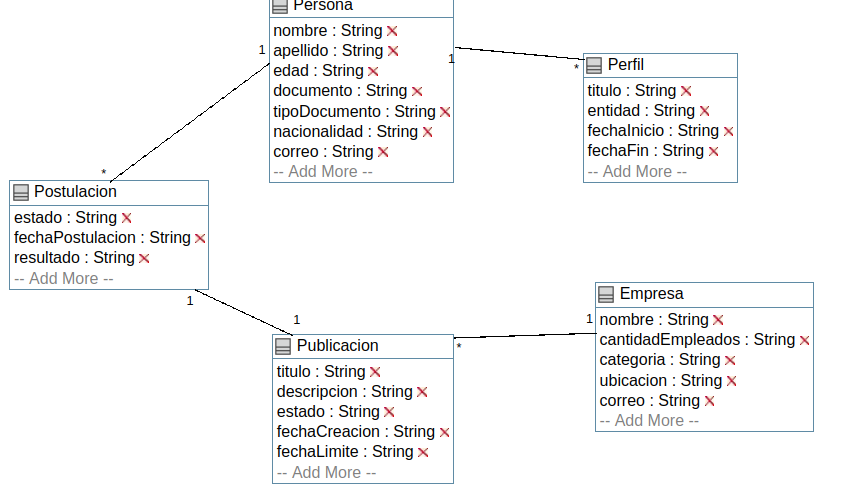

## Trabajo en equipo 
- Damian Algañaras
- Rchard Stier
 
## Diseño OO 
#### Diagrama de Clases

## Wireframe y caso de uso 

#### Caso de uso: Crear un perfil empresa
- El usuario empresa selecciona crear un perfil.
- Se muestra al usuario el formulario para la creacion.
- Se crea el usuario empresa.
  

#### Caso de uso: Crear un perfil empresa
- El usuario empresa selecciona crear una publicación.
- Se muestra al usuario el formulario para la creacion.
- El usuario empresa crea la publicación.
  

## Backlog de iteraciones 

| ID    | Historia de usuario                                                                   |
| :---- | ------------------------------------------------------------------------------------- |
| HU-9  | Como empresa quiero crear anuncios para poder publicarlos,                            |
| HU-10 | Como empresa quiero crear un perfil con datos basicos.                                |

## Tareas 

- Generar el modelo según el diagrama de clases.
- Realizar el formulario para cargar los datos correspondientes.
- Asignar las rutas al formulario.
- Configurar la Base de datos para poder persistir la información.

## Retrospectiva

 Hasta el momento de este release, se logró avanzar con dos historias de usuario basicas, se está analizando la posibilidad de incluir mas datos en la creacion de estos componentes.