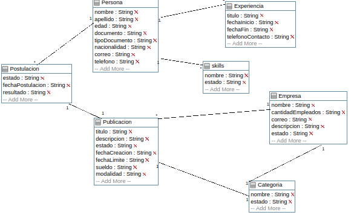

## Trabajo en equipo 
- Damian Algañaras
- Rchard Stier
 
## Diseño OO 
#### Diagrama de Clases

## Wireframe y caso de uso 

- Como usuario quiero ver ingresar mis datos basicos en mi perfil.
- Como usuario quiero cargar mis datos de perfil para complementar la postulación.
- Como usuario quiero ver mis datos en mi perfil para validarlos.
- Como usuario quiero ver las publicaciones de la bolsa de trabajo.

#### Caso de uso: Crear un perfil persona
- El usuario crear un perfil.
- Se muestra al usuario el formulario para la creacion.
- Se crea el usuario persona.
  
#### Caso de uso: Crear datos para perfil laboral
- El usuario persona selecciona agregar datos al perfil laboral.
- Se muestra al usuario el formulario para la creacion.
- El usuario agrega los datos adicionales del perfil.
  
## Backlog de iteraciones 

| ID    | Historia de usuario                                                                   |
| :---- | ------------------------------------------------------------------------------------- |
| HU-1  | Como usuario quiero ver ingresar mis datos basicos en mi perfil.                      |
| HU-2 | Como usuario quiero cargar mis datos de perfil para complementar la postulación.       |
| HU-3 | Como usuario quiero ver mis datos en mi perfil para validarlos                         |
| HU-4 | Como usuario quiero ver las publicaciones de la bolsa de trabajo.                      |

## Tareas 

- Generar el modelo según el diagrama de clases.
- Realizar el formulario para cargar los datos correspondientes.
- Asignar las rutas al formulario.
- Configurar la Base de datos para poder persistir la información.

## Retrospectiva

 Hasta el momento de este release, se logró avanzar con dos historias de usuario basicas, se está analizando la posibilidad de incluir mas datos en la creacion de estos componentes.