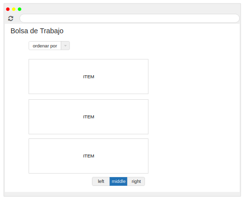
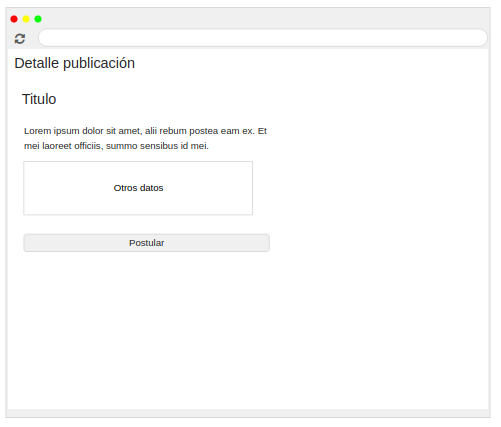

## Trabajo en equipo 
- Damian Algañaras
- Rchard Stier
 
## Diseño OO 
#### Diagrama de Clases

## Wireframe y caso de uso 

- Como usuario quiero ver ingresar mis datos basicos en mi perfil.
- Como usuario quiero cargar mis datos de perfil para complementar la postulación.
- Como usuario quiero ver mis datos en mi perfil para validarlos.
- Como usuario quiero ver las publicaciones de la bolsa de trabajo.

#### Caso de uso: Ver datos del perfil
- El usuario ingresa a la plataforma.
- Selecciona ver mis datos.
- Se muestra los datos del perfil al usuario.

#### Caso de uso: Ver publicaciones
- El usuario persona ingresa a la plataforma.
- El usuario persona selecciona ver bolsa de trabajo.
- Se muestran al usuario las publicaciones.
  

#### Caso de uso: Ver detalle de publicaciones
- El usuario persona selecciona alguna publicación.
- Se muestra al usuario el detalle de la publicación.

#### Caso de uso: Postular a una publicación
- El usuario persona selecciona alguna publicación.
- Se muestra al usuario el detalle de la publicación.
- El usuario solicita postular a la publicación.

  
## Backlog de iteraciones 

| ID    | Historia de usuario                                                                   |
| :---- | ------------------------------------------------------------------------------------- |
| HU-3 | Como usuario quiero ver mis datos en mi perfil para validarlos                         |
| HU-4 | Como usuario quiero ver las publicaciones de la bolsa de trabajo.                      |
| HU-5 |Como usuario quiero ver los detalles de alguna publicacion para ver datos relevantes.   |
| HU-6 | Como usuario quiero poder postular a esa publicacion.                                  |

## Tareas 

- Generar el modelo según el diagrama de clases.
- Realizar el formulario para cargar los datos correspondientes.
- Asignar las rutas al formulario.
- Configurar la Base de datos para poder persistir la información.

## Retrospectiva

 Hasta el momento de este release, se logró con las historias de usuario pendientes de la iteración 1, en la iteracion 2 se completaron las siguientes: HU-1, HU-2. En la Iteracion 3 se van a completar las pendientes de la Iteracion 2 y se agregaron: HU-5, HU-6.