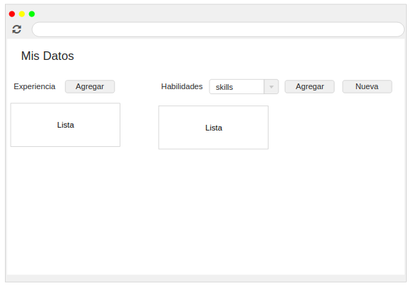
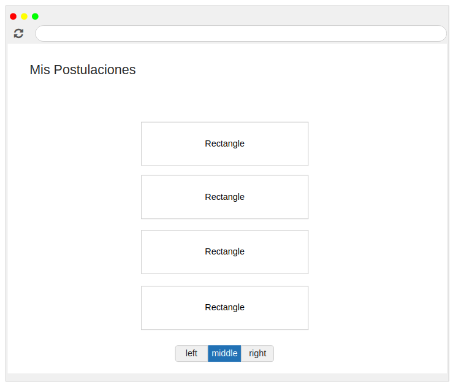
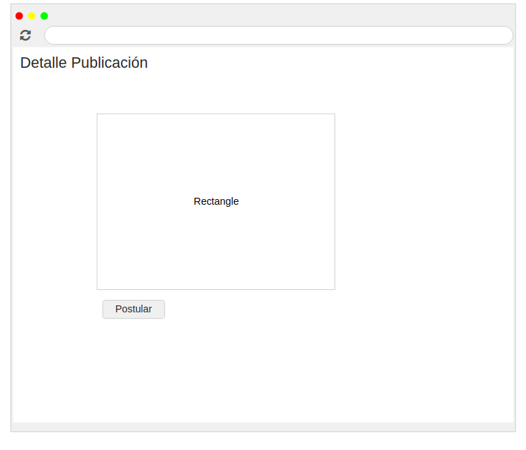
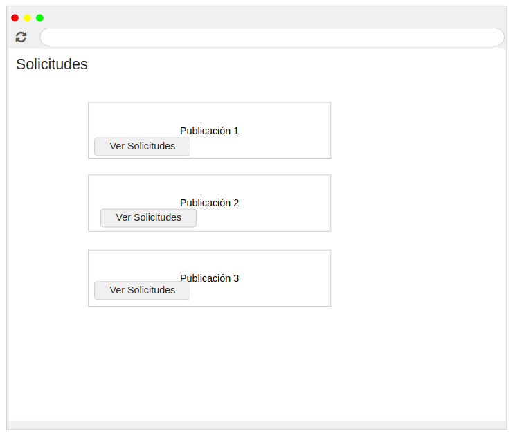

## Trabajo en equipo 
- Damian Algañaras
- Rchard Stier
 
## Diseño OO 
#### Diagrama de Clases

## Wireframe y caso de uso 

- Como usuario quiero ver ingresar mis datos basicos en mi perfil.
- Como usuario quiero cargar mis datos de perfil para complementar la postulación.
- Como usuario quiero ver mis datos en mi perfil para validarlos.
- Como usuario quiero ver las publicaciones de la bolsa de trabajo.

#### Caso de uso: Ver datos del perfil
- El usuario ingresa a la plataforma.
- Selecciona ver mis datos.
- Se muestra los datos del perfil al usuario.

#### Caso de uso: Ver Historial de publicaciones usuario persona
- El usuario persona selecciona alguna publicación.
- Se muestra al usuario el detalle de la publicación.
- El usuario solicita postular a la publicación.
- 

#### Caso de uso: Postular a una publicación
- El usuario persona selecciona alguna publicación.
- Se muestra al usuario el detalle de la publicación.
- El usuario solicita postular a la publicación.

#### Caso de uso: Ver perfiles que postularon a las publicaciones
- El usuario empresa selecciona ver postulaciones.
- Se muestra la lista de postulantes por cada publicación.

## Backlog de iteraciones 

| ID   | Historia de usuario                                                                  |
| :----| -----------------------------------------------------------------------------------  |
| HU-3 | Como usuario quiero ver mis datos en mi perfil para validarlos                       |
| HU-4 | Como usuario quiero ver las publicaciones de la bolsa de trabajo.                    |
| HU-5 | Como usuario quiero ver los detalles de alguna publicacion para ver datos relevantes.|
| HU-6 | Como usuario quiero poder postular a esa publicacion.                                |
| HU-7 | Como usurario quiero ver el historial de mis postulaciones.                          |
| HU-12| Como empresa deseo ver los perfiles de los usuarios que postularon al anuncio.       |

## Tareas 

- Generar el modelo según el diagrama de clases.
- Realizar el formulario para cargar los datos correspondientes.
- Asignar las rutas al formulario.
- Configurar la Base de datos para poder persistir la información.

